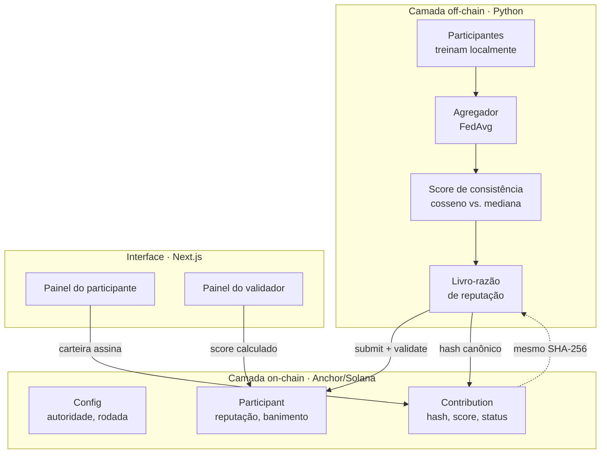

# AwakeFL — visão técnica

Como o sistema funciona por dentro, como rodar cada camada e onde procurar cada
coisa. Para o que o projeto é e por que existe, veja o [README principal](README.md).

---

## Índice

- [Arquitetura](#arquitetura)
- [O ciclo, passo a passo](#o-ciclo-passo-a-passo)
- [Como a nota é calculada](#como-a-nota-é-calculada)
- [O modelo de reputação](#o-modelo-de-reputação)
- [A camada on-chain](#a-camada-on-chain)
- [A ponte entre as camadas](#a-ponte-entre-as-camadas)
- [Estrutura do repositório](#estrutura-do-repositório)
- [Rodando](#rodando)
- [Testes e CI](#testes-e-ci)
- [Limitações conhecidas](#limitações-conhecidas)

---

## Arquitetura

Três camadas independentes, que se encontram em dois pontos: o **hash dos pesos**
e a **conta de reputação**.



Cada camada roda sozinha. A simulação de FL funciona sem blockchain (`--chain
simulado`), o programa Anchor funciona sem a simulação, e o site funciona com a
demo determinística sem carteira. Isso é de propósito: cada uma é testável
isoladamente.

### Onde o AwakeFL se encaixa

O AwakeFL não executa a federação. O que ele é, em código, são três chamadas
dentro do momento em que o servidor tem todas as atualizações da rodada na mão —
o único ponto em que dá para comparar umas com as outras:

```python
outcome = ledger.process_round(rodada, deltas)       # pontua
chain.register_contribution(...)                     # registra on-chain
weights = ledger.aggregation_weights(...)            # repondera a média
```

Existem dois hospedeiros para essas três linhas, selecionados por `--backend`:

| Backend | Quem roda o laço | Estado |
| --- | --- | --- |
| `local` (padrão) | `run_federated`, um laço próprio | é daqui que vêm todos os números medidos |
| `flower` | `flwr.simulation.start_simulation` | a estratégia existe e é testada; **nunca executou uma rodada** |

No caminho Flower, o encaixe é literal: [`AwakeFLStrategy`](awakefl-fl/server.py)
herda de `FedAvg` e sobrescreve **um** método, `aggregate_fit`. Configuração de
rodada, amostragem de clientes e avaliação continuam sendo do Flower —
`tests/test_server_flower.py` trava isso numa asserção.

A federação do backend `local` não é o produto: é bancada de teste. Para medir
precisão e recall do detector é preciso **saber quem são os atacantes**, e
nenhuma federação real envenena o próprio modelo para você medir. Por isso ela
existe — e é por isso que os resultados vêm dela.

> Rodar o caminho Flower de ponta a ponta exige `pip install "flwr[simulation]"`
> (traz o Ray). Sem o Ray, só a construção da estratégia é exercitada.

## O ciclo, passo a passo

1. **Treino local.** Cada participante roda um número fixo de passos de SGD sobre
   os próprios dados, particionados de forma não-IID por Dirichlet.
2. **Compromisso.** Os pesos viram um artefato canônico `.awfl`, e o SHA-256
   desse arquivo é o compromisso. Só o hash vai para a chain — os pesos ficam
   fora.
3. **Consenso da rodada.** O agregador calcula a mediana por coordenada de todos
   os updates recebidos. Esse vetor é a referência.
4. **Score.** Cada update é comparado com a referência em direção e magnitude.
5. **Reputação.** O score entra na média móvel do participante.
6. **Assinatura.** O validador fecha a rodada: assina os scores calculados e
   avança a rodada global.
7. **Banimento.** Quem cai abaixo do limiar tem a reputação dividida por 10 e é
   permanentemente banido. Não há instrução que reverta.

## Como a nota é calculada

O score de consistência combina duas medidas independentes:

```
S = 0,7 · direção + 0,3 · magnitude
```

**Direção** é a similaridade de cosseno entre o update do participante e a
mediana por coordenada da rodada, calibrada pelo cosseno mediano do grupo — não
por um limiar absoluto. O que importa é destoar *em relação aos demais*, e isso
muda de rodada para rodada.

**Magnitude** é `min(r, 1/r)`, onde `r` é a razão entre a norma do update e a
norma mediana. É simétrico de propósito: update grande demais denuncia
amplificação; update pequeno demais denuncia o free-rider, que não treina e
devolve o modelo quase intocado.

**Veto de norma.** Se a norma passa de um múltiplo da mediana, o crédito de
direção é **zerado**, não descontado. É a defesa contra *model replacement*, onde
o atacante aponta na direção certa mas com magnitude suficiente para dominar a
média.

Três decisões que não são óbvias:

- **Mediana, não média.** A média tem *breakdown point* zero — um único atacante
  amplificado vira ele o consenso. A mediana só é corrompível controlando mais da
  metade dos participantes.
- **Cosseno, não distância euclidiana.** Um participante com mais dados produz um
  update naturalmente maior; com distância euclidiana ele pareceria divergente
  **por ser grande**.
- **Passos fixos, nivelados pelo maior participante.** Um participante pequeno
  daria menos passos de SGD e produziria mais ruído angular — e era punido por
  isso. Este foi o bug mais sério encontrado no projeto: um honesto com 436
  amostras chegou a ser banido.

## O modelo de reputação

| Parâmetro | Off-chain | On-chain |
| --- | --- | --- |
| Escala | `0..1` | `0..=1000` |
| Reputação inicial | `0.5` | `500` |
| Atualização | `R(t) = 0,5·R(t−1) + 0,5·S(t)` | `(R + S) / 2`, inteira |
| Limiar de banimento | `0.4` | `400` |
| Penalidade | `R / 10` + banimento | idem |
| Graça | por `contrib_count`, não por rodada global | idem |

**Por que a reputação inicial é neutra e não boa-fé.** `register_participant` é
aberto — uma carteira nova custa o aluguel de uma conta de 66 bytes. Se o
recém-chegado nascesse com reputação máxima, o banimento permanente valeria zero:
bastaria registrar outra carteira. Começar no meio faz a reputação acumulada
valer alguma coisa.

**Por que a graça conta tempo de casa.** Se o período de graça fosse contado pela
rodada global, quem se registrasse na rodada 50 entraria desprotegido. Contando
por `contrib_count`, todo participante tem a mesma proteção inicial.

**Por que a penalidade divide por 10 em vez de zerar.** Contra o *sleepy
adversary*: quem acumula reputação com rodadas honestas antes de envenenar perde
proporcionalmente mais. Zerar trataria igual quem construiu 875 pontos e quem
nunca passou de 500.

## A camada on-chain

Programa Anchor publicado na Devnet:

```
GhMhTkv7jeHMejEyypQaEFPqduHgXDSzE5g7jE3rXGRA
```

### Contas (PDAs)

| Conta | Seeds | Tamanho | Papel |
| --- | --- | --- | --- |
| `Config` | `["config"]` | 57 B | autoridade, rodada corrente, total de participantes |
| `Participant` | `["participant", owner]` | 66 B | reputação, `contrib_count`, flag de banimento, `stake_amount` |
| `Contribution` | `["contribution", participant, round_le]` | 142 B | hash dos pesos, `n_samples`, loss, acurácia, status |

O `bump` é guardado em cada conta — recalcular o PDA custa ~1.500 CU por chamada
a `find_program_address`.

### Instruções

| Instrução | Signer | Efeito |
| --- | --- | --- |
| `initialize` | autoridade | cria o `Config` |
| `register_participant` | participante | cria o `Participant` com reputação 500 |
| `submit_contribution(hash, n_samples, loss, accuracy)` | participante | registra o compromisso da rodada corrente |
| `validate_contribution(score)` | autoridade | aplica a EMA e marca Aprovado/Rejeitado |
| `penalize_participant(reason_code)` | autoridade | reputação / 10 + banimento permanente |
| `advance_round` | autoridade | incrementa a rodada global |

Uma `Contribution` tem três estados: `Pendente` no envio, `Aprovado` ou
`Rejeitado` quando pontuada. Não há quarto estado e **não existe instrução que
remova uma contribuição** — nem para a autoridade, nem para o dono.

Isso é deliberado, e custou uma discussão para chegar aqui. Uma submissão que
nunca foi julgada fica `Pendente` para sempre, e isso é a coisa mais honesta que
a cadeia pode registrar: que a autoridade não a julgou. Qualquer instrução de
remoção ou de encerramento acrescentaria uma ação da autoridade por cima desse
fato — arrumando a aparência de uma omissão. O custo é ergonômico, e o painel
resolve mostrando essas pendências numa seção separada da fila de trabalho.

### Travas

- `submit_contribution` recusa participante banido (`ParticipantBanned`) e hash
  maior que 64 caracteres (`HashTooLong`).
- `validate_contribution` recusa score acima de 1000 (`InvalidScore`) e
  revalidação (`AlreadyValidated`); só a autoridade assina (`ConstraintHasOne`).
- `penalize_participant` recusa segunda penalidade (`AlreadyBanned`) e — esta é a
  trava que importa — **recusa banir quem ainda está acima do limiar**
  (`ReputationAboveThreshold`). A autoridade não pode contradizer o registro
  público.

> Essa trava **está publicada** na Devnet desde 2026-08-24 (slot 487585196).
> Conferido lendo o bytecode: a mensagem `Reputacao ainda acima do limiar` está
> no binário.

Variante nova de erro vai sempre no **fim** do enum: o Anchor numera por posição
(6000 + índice), e inserir no meio renumera os erros seguintes, quebrando
qualquer cliente que trate código.

## A ponte entre as camadas

O ponto mais delicado do sistema é o hash: se o formato de bytes divergir entre o
navegador e o servidor, o compromisso registrado na chain não prova nada.

**Formato canônico**, definido byte a byte e implementado numa única função
(`canonical_chunks()`):

```
para cada tensor, na ordem do state_dict:
    número de dimensões   u32 little-endian
    cada dimensão         u32 little-endian
    valores               float32 little-endian
```

O navegador calcula o SHA-256 dos bytes do arquivo `.awfl`; o servidor calcula o
seu com `hash_weights()`. O CI verifica que os dois batem — é o teste que impede
a costura de abrir em silêncio.

Duas armadilhas resolvidas nessa ponte:

- **A rodada é da chain, não do servidor.** O PDA da contribuição usa
  `config.current_round`. Derivar do contador local do servidor falharia com
  `ConstraintSeeds` na primeira transação real — e o modo *dry-run* nunca
  mostraria isso.
- **IDL único, convertido em memória.** O anchorpy 0.21 lê o formato legado; o
  Anchor 0.30+ gera o novo. Em vez de manter duas cópias que divergem, a
  conversão acontece em memória (`para_idl_legado()`).

## Estrutura do repositório

```
awakeFL/
├── programs/awakefl/         programa Anchor (Rust) — a camada on-chain
│   └── src/
│       ├── lib.rs            as 6 instruções
│       └── state.rs          as 3 contas e as constantes do modelo
├── awakefl-fl/               simulação de Federated Learning (Python)
│   ├── model.py              CNN e o laço de treino
│   ├── data.py               particionamento IID e não-IID por Dirichlet
│   ├── client.py             o participante
│   ├── attacks.py            label flipping, gradient poisoning, backdoor, free-rider
│   ├── server.py             agregação e orquestração das rodadas
│   ├── reputation.py         score de consistência e livro-razão  ★
│   ├── onchain_interface.py  formato canônico e ledger simulado
│   ├── anchor_client.py      cliente real da Devnet
│   ├── run_experiments.py    ponto de entrada dos cenários A/B/C
│   └── docs/                 (na branch documentacao)
├── web/                      site e painel (Next.js 16, React 19)
├── tests/awakefl.ts          testes do programa Anchor
├── playground/lib.rs         cópia em arquivo único para o Solana Playground
└── scripts/                  utilitários de sincronização
```

## Rodando

### Camada off-chain (sem blockchain)

```bash
cd awakefl-fl
pip install -r requirements.txt
python run_experiments.py
```

Roda os três cenários e escreve o relatório comparativo. Sem argumentos, usa o
`config.yaml`.

Argumentos úteis:

```bash
python run_experiments.py --attack backdoor --rounds 20 --clients 15
python run_experiments.py --scenarios A B          # pula a defesa
python run_experiments.py --chain dry-run          # monta as transações sem enviar
python run_experiments.py --export-weights         # gera os artefatos .awfl
```

Varredura de sementes, para resultado com desvio padrão:

```bash
python sweep.py --seeds 10 --attacks label_flipping gradient_poisoning
```

### Camada on-chain

Requer Rust, Solana CLI e Anchor (via `avm`). No Windows, use **WSL2**.

```bash
anchor keys sync                                   # sincroniza declare_id! e Anchor.toml
anchor test --provider.cluster localnet            # build + testes num validator efêmero
```

Reaproveitando um validator já rodando:

```bash
solana-test-validator --reset                      # terminal 1
solana config set --url localhost                  # terminal 2
anchor test --skip-local-validator --provider.cluster localnet
```

Deploy na Devnet:

```bash
solana config set --url devnet
solana airdrop 2
anchor build
anchor keys sync
anchor deploy --provider.cluster devnet
```

### Site

Em produção: **[awake-fl.vercel.app](https://awake-fl.vercel.app/)** (Vercel,
publicado a partir da `main`).

Localmente:

```bash
cd web
npm ci
npm run dev
```

O painel precisa de `NEXT_PUBLIC_PROGRAM_ID`. Sem ela, as telas do participante
mostram um aviso em vez de falharem em silêncio — e a `/simulacao` continua
funcionando, porque não depende da chain.

### Solana Playground

O Playground usa uma estrutura mais enxuta. Copie:

- `programs/awakefl/src/lib.rs` → `src/lib.rs`
- `tests/awakefl.ts` → `tests/anchor.test.ts`

Lá o `declare_id!` é sincronizado no build e o cluster sai da UI — não há
`Anchor.toml`. Nos testes, troque `anchor.workspace.Awakefl` por `pg.program`.

## Testes e CI

Três jobs, em [`.github/workflows/ci.yml`](.github/workflows/ci.yml):

| Job | O que cobre |
| --- | --- |
| **FL off-chain** | 67 testes de pytest, mais uma fumaça de ponta a ponta que confere o hash dos artefatos contra o livro-razão |
| **Playground em dia** | garante que `playground/lib.rs` não divergiu de `programs/awakefl/src` |
| **Web** | lint e build do Next.js |

Os testes do programa Anchor **não** rodam no CI: exigem toolchain Rust + Solana
CLI + Anchor e um validator local, o que custa vários minutos por execução.
Rodam localmente com `anchor test`.

O CI instala dependências com versões exatas e `--only-binary :all:`, e o
`npm ci` roda com `--ignore-scripts`. O `requirements.txt` mantém `>=` de
propósito, para instalação local ter folga de resolução.

## Limitações conhecidas

Resumo do que está aberto. A lista completa, com o desenho experimental de cada
item, está em
[O Que Falta no AwakeFL](https://github.com/AlessaLeit/awakeFL/blob/documentacao/awakefl-fl/docs/o-que-falta.md).

| Limitação | Estado |
| --- | --- |
| Score calculado off-chain | ponto único de confiança que sobra no desenho |
| Autoridade única | comitê, quórum e contestação desenhados, não implementados |
| Resistência a Sybil | parcial; `stake_amount` existe e está zerado |
| Latência na Solana | não medida; o custo foi (2026-08-27, ver [README](README.md#por-que-solana)) |
| Baseline da literatura | não comparado com Krum, mediana pura ou FLTrust |
| Datasets | só MNIST; CIFAR-10 previsto e não executado |
| Participação parcial | `fraction_fit` implementado, nunca exercitado |
| *Slow poisoning* | não avaliado; os quatro ataques são de efeito imediato |
| Backend Flower | a estratégia existe e é testada; nunca executou uma rodada (falta o Ray) |

## Documentação de apoio

Na branch `documentacao`:

- [Anatomia do AwakeFL](https://github.com/AlessaLeit/awakeFL/blob/documentacao/awakefl-fl/docs/anatomia-awakefl.html) — a arquitetura em dois níveis de leitura
- [Aritmética da Reputação](https://github.com/AlessaLeit/awakeFL/blob/documentacao/awakefl-fl/docs/aritmetica-reputacao.html) — as contas passo a passo, com números reais
- [Registro de decisões](https://github.com/AlessaLeit/awakeFL/blob/documentacao/awakefl-fl/docs/registro-de-decisoes.md) — 23 decisões, 7 achados experimentais, 6 erros
- [Trajetória do desenvolvimento](https://github.com/AlessaLeit/awakeFL/blob/documentacao/awakefl-fl/docs/trajetoria-do-desenvolvimento.md) — a história e os trabalhos relacionados
- [O Que Falta](https://github.com/AlessaLeit/awakeFL/blob/documentacao/awakefl-fl/docs/o-que-falta.md) — as 12 perguntas em aberto

E nos subprojetos: [`awakefl-fl/README.md`](awakefl-fl/README.md) e
[`web/README.md`](web/README.md).
