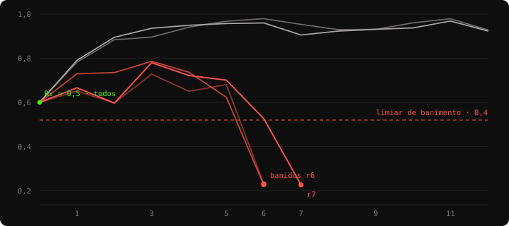
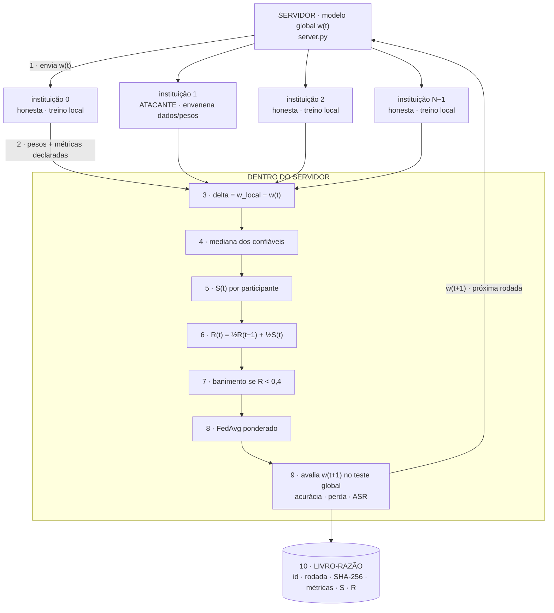
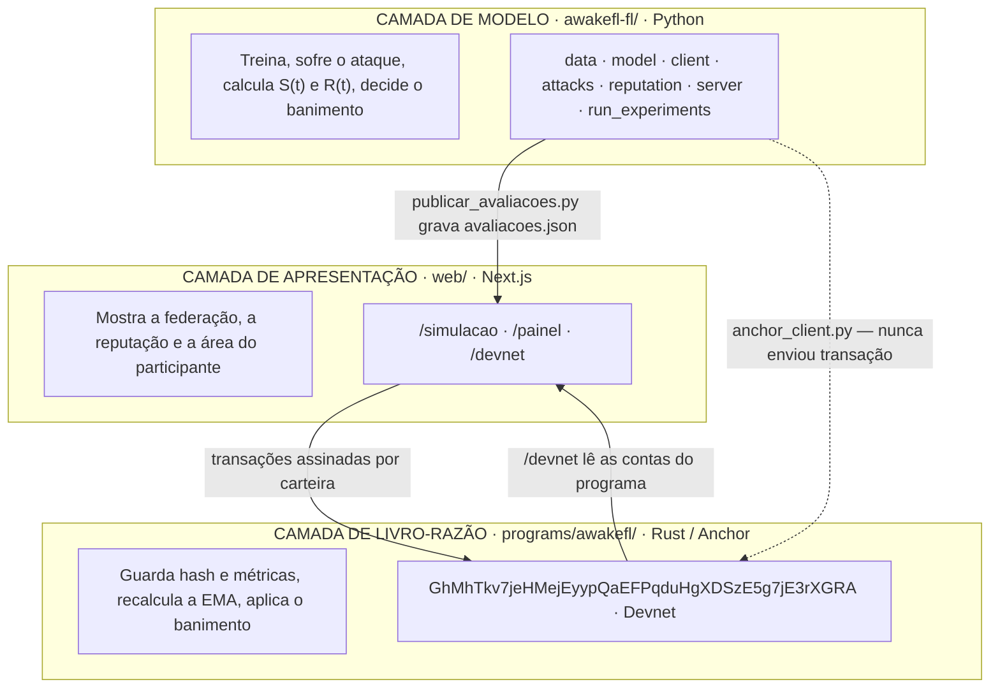

# Anatomia do AwakeFL

Um sistema em que várias instituições treinam **um modelo em conjunto sem trocar dados**, e uma blockchain guarda o registro de quem contribuiu bem e quem tentou sabotar. Este documento abre o sistema peça por peça: cada parte é explicada primeiro em palavras simples, depois no detalhe técnico — e só no fim tudo é remontado.

- **Em palavras simples** — A ideia da peça, sem jargão e sem fórmula. Se você só ler estes blocos, do começo ao fim, ainda assim entende o sistema inteiro.
- **No detalhe técnico** — Como está implementado de fato, com as fórmulas, os parâmetros e — mais importante — *por que* foi decidido assim e não de outro jeito.

## Sumário

- [Os dados e as instituições](#os-dados-e-as-instituições)
- [O modelo que todos treinam](#o-modelo-que-todos-treinam)
- [O participante](#o-participante)
- [Os ataques](#os-ataques)
- [O score de consistência S(t)](#o-score-de-consistência-st)
- [A reputação R(t)](#a-reputação-rt)
- [O banimento](#o-banimento)
- [A agregação](#a-agregação)
- [O livro-razão e o hash](#o-livro-razão-e-o-hash)
- [O programa on-chain](#o-programa-on-chain)
- [Os três experimentos](#os-três-experimentos)
- [Uma rodada, ponta a ponta](#uma-rodada-ponta-a-ponta)
- [As três camadas](#as-três-camadas)
- [O que os números dizem](#o-que-os-números-dizem)

---

## Os dados e as instituições

*Parte 01 · data.py*

> **Em palavras simples**
>
> Imagine dez hospitais que querem, juntos, treinar um sistema que lê exames. Nenhum deles pode mostrar os prontuários dos pacientes para os outros — é ilegal e seria antiético. A saída é cada um treinar com o que tem em casa e compartilhar só o **aprendizado**, nunca os dados.
>
> Para simular isso num computador só, pegamos um conjunto de imagens (dígitos escritos à mão) e cortamos em dez pedaços que não se repetem. Cada pedaço vira o "hospital" de um participante, e ele nunca vê os outros nove.
>
> Só que hospitais reais não são iguais: um atende mais idosos, outro é referência em pediatria. Então o corte não é justo de propósito — cada participante recebe uma mistura diferente de dígitos. É isso que torna o problema realista, e difícil.

> **No detalhe técnico**
>
> MNIST (ou Fashion-MNIST) é particionado em *N* shards disjuntos. Dois regimes, selecionáveis por `data.partition`:
>
> - **IID** — amostragem aleatória uniforme. Cenário fácil: as distribuições locais são parecidas, então os updates honestos apontam quase todos na mesma direção e o detector de anomalias tem vida boa.
> - **Não-IID (Dirichlet)** — a proporção de cada classe por participante é sorteada de uma Dirichlet(α). α menor = participantes mais especializados. É o padrão do projeto (α = 0,7).
>
> A escolha do não-IID como padrão é o que dá peso ao trabalho: **updates honestos já divergem naturalmente entre si** nesse regime, então o detector precisa separar "divergente porque os dados são heterogêneos" de "divergente porque é malicioso". Um detector que só funciona em IID não prova nada — o caso IID é justamente aquele em que qualquer limiar ingênuo acerta.

## O modelo que todos treinam

*Parte 02 · model.py*

> **Em palavras simples**
>
> Todo mundo treina exatamente a **mesma** rede neural — a mesma arquitetura, os mesmos botões de ajuste. O que muda de participante para participante são só os valores desses botões depois do treino, porque cada um viu dados diferentes.
>
> Esses valores é que viajam pela rede. É a diferença central do Federated Learning: circulam **parâmetros do modelo, nunca exames de paciente**.

> **No detalhe técnico**
>
> CNN pequena e didática, 215 370 parâmetros treináveis:
>
> ```text
> 1×28×28 → conv(16, 5×5) → pool → conv(32, 5×5) → pool → 32·7·7 → 128 → 10
> ```
>
> `padding=2` com kernel 5 mantém a resolução, deixando todo o downsample por conta do pooling — assim o tamanho do *flatten* é trivial de acompanhar a olho, o que importa num código que vai ser lido por banca. Treino local com SGD + momentum, `CrossEntropyLoss` sobre logits.
>
> `get_weights()` / `set_weights()` convertem o `state_dict` para lista de arrays NumPy na ordem do dicionário. Essa ordem é **contrato**: é ela que o hash SHA-256 da Parte 09 assume, e o lado Rust precisa reproduzir byte a byte.

## O participante

*Parte 03 · client.py*

> **Em palavras simples**
>
> Cada rodada funciona como um ciclo de estudo. O servidor manda o modelo atual para todos; cada participante estuda um pouco com os próprios dados; e devolve o modelo com o que aprendeu, junto de um bilhete dizendo como acha que foi ("acertei 92%").
>
> Esse bilhete é **autodeclarado** — ou seja, pode ser mentira. Um atacante escreve o que quiser nele. Por isso o servidor nunca julga ninguém pelo bilhete: ele julga pelo que a pessoa efetivamente entregou.

> **No detalhe técnico**
>
> ```text
> servidor → pesos globais → [ataque nos dados?] → treino local
         → [ataque nos pesos?] → pesos + métricas declaradas → servidor
> ```
>
> A mesma classe `AwakeFLClient` serve aos dois backends (motor local e `NumPyClient` do Flower). Isso evita a armadilha clássica de "o cliente do teste não é o cliente do experimento" — se o objeto testado não for o mesmo que roda, o teste não prova nada sobre o experimento.
>
> Honestidade experimental: o cliente malicioso reporta métricas de verdade dos próprios dados envenenados (ou repete a anterior, no caso do free-rider). O servidor as guarda no livro-razão como **evidência do que foi declarado**, e nunca as usa para decidir reputação.

## Os ataques

*Parte 04 · attacks.py*

> **Em palavras simples**
>
> Para provar que a defesa funciona, é preciso ter de quem se defender. O sistema sabe transformar qualquer participante em sabotador, de quatro maneiras diferentes.
>
> Duas delas mexem no **material de estudo**: o participante estuda com o gabarito trocado, ou decora um sinal secreto ("toda imagem com um quadradinho branco no canto é a letra A"). As outras duas mexem na **entrega**: manda o dever de casa com tudo invertido e gritado bem alto, ou não estuda nada e devolve o que recebeu, fingindo trabalho.

> **No detalhe técnico**
>
> | Ataque | Camada | O que faz | Detecção |
> | --- | --- | --- | --- |
> | `label_flipping` | dados | troca os rótulos locais (`y → 9-y`) | **difícil** — o update fica bem comportado em norma; só a direção denuncia |
> | `backdoor` | dados + pesos | gatilho branco 3×3 no canto inferior direito, classe alvo forçada e update amplificado | média — acurácia limpa fica intacta, por isso mede-se a ASR |
> | `gradient_poisoning` | pesos | inverte e amplifica o update (×5) | fácil — cai em 2–3 rodadas |
> | `free_rider` | pesos | não treina; devolve o modelo global com ruído | fácil — pego pelo termo de magnitude |
>
> A taxonomia segue a literatura de FL robusto (Bagdasaryan et al. 2020; Fang et al. 2020). Os dois extremos estão cobertos de propósito: ataques de **dados** são sutis e derrotam defesas baseadas só em magnitude; ataques de **pesos** são agressivos e caem rápido. Ter os dois permite discutir o trade-off entre sutileza e latência de detecção em vez de afirmar "a defesa funciona" com um único caso favorável.
>
> No backdoor, o relatório reporta a **ASR** (*attack success rate*): a fração das amostras com gatilho classificadas como a classe alvo. É a métrica que expõe o perigo — a acurácia limpa pode não se mexer enquanto a ASR sobe para perto de 100%.

## O score de consistência S(t)

*Parte 05 · reputation.py*

> **Em palavras simples**
>
> Aqui está o detetive do sistema. A cada rodada ele faz uma pergunta simples sobre cada participante: **"você puxou o modelo para o mesmo lado que o grupo, e com força parecida?"**
>
> São duas perguntas na verdade. A primeira é sobre **direção**: se todo mundo empurrou o modelo para a direita e você empurrou para a esquerda, algo está errado. A segunda é sobre **força**: se todo mundo deu um empurrãozinho e você deu um tranco — ou nem encostou —, também está errado. Uma pega o sabotador, a outra pega o preguiçoso.
>
> A resposta vira uma nota de 0 a 1 para aquela rodada. E — detalhe que faz toda a diferença — a nota é sempre comparada com o participante *mediano* daquela rodada, não com um valor fixo. Assim o detetive não se assusta quando a turma inteira está tendo um dia difícil.

> **No detalhe técnico**
>
> ```text
> S(t) = 0,7 · clip( max(0, cos) / cos_mediano )  +  0,3 · min(r, 1/r)
       └──────── DIREÇÃO ────────┘         └── MAGNITUDE ──┘
> ```
>
> Opera sobre o **delta** (`w_local − w_global`), não sobre os pesos absolutos: o que interessa é para onde o participante puxou o modelo nesta rodada, não onde ele está.
>
> ### Por que cosseno e não distância euclidiana
>
> O cosseno é **invariante à escala**. Em cenário não-IID, um hospital com mais dados produz naturalmente um update maior; puni-lo por isso seria falso positivo puro. A pergunta certa é sobre o sentido, não sobre o tamanho — e o tamanho é tratado separadamente, no segundo termo.
>
> ### Por que mediana e não média
>
> A referência é a **mediana por coordenada** dos updates confiáveis. A mediana tem *breakdown point* de 50%: resiste até que metade da amostra seja adversária. Com média, um único atacante amplificando o update em 100× deslocaria a própria referência e passaria a *ser* o consenso — o ataque clássico contra defesas ingênuas, em que a vítima é o detector.
>
> ### Por que a magnitude é simétrica
>
> `min(r, 1/r)` pune igualmente updates gigantes (poisoning, model replacement) e minúsculos (free-rider). O cosseno sozinho não pegaria o free-rider: a direção do ruído dele não é oposta ao consenso, é apenas aleatória.
>
> ### Por que tudo é calibrado pela mediana da rodada
>
> Em dados IID, updates honestos têm cosseno ~0,9 entre si; em não-IID isso cai para ~0,4 *sem que ninguém seja malicioso*. Um limiar absoluto ou baniria a federação inteira no caso não-IID, ou não pegaria ninguém no caso IID. Calibrando pela mediana, S(t) responde **"quão pior que o participante mediano você está nesta rodada"** — pergunta invariante ao regime de dados.
>
> ### O veto de norma
>
> Um update com mais de 2,5× (ou menos de 1/2,5×) a norma mediana perde o crédito do termo de direção. Fecha a brecha do *model replacement*: o atacante que alinha perfeitamente a direção com o consenso mas amplifica a magnitude para dominar sozinho o FedAvg tiraria nota alta nos 0,7 do primeiro termo.

## A reputação R(t)

*Parte 06 · reputation.py*

> **Em palavras simples**
>
> A nota S(t) é de uma rodada só. Ninguém deve ser condenado por um dia ruim — pode ter sido a internet, pode ter sido azar na amostra. A reputação é a **ficha corrida**: mistura a nota de hoje com a ficha de ontem, meio a meio.
>
> Como é sempre meio a meio, o passado vai perdendo peso: o que aconteceu há cinco rodadas responde por 3% da nota de hoje. Na prática o sistema **perdoa um tropeço e condena um padrão**.
>
> Todo mundo começa em 0,5 — no meio da escala, nem confiável nem suspeito. Você precisa *merecer* a confiança contribuindo bem, e um participante honesto chega a ~0,93 em umas quatro rodadas.

> **No detalhe técnico**
>
> ```text
> R(t) = α · R(t−1) + (1 − α) · S(t)          α = 0,5

R₀ = 0,5  ≡ INITIAL_REPUTATION = 500 na escala 0..1000 do Anchor
> ```
>
> É uma média móvel exponencial. O peso de R₀ cai como 0,5^t^: 50% após uma rodada, 3% após cinco. Consequência importante: **R(t) converge para a média de S(t)** independentemente de onde começou. α maior = mais memória, detecção mais lenta; α menor = reativo demais, mais falso positivo.
>
> ### Por que o valor inicial é neutro e não máximo
>
> `register_participant` é aberto: qualquer wallet se registra pelo custo do *rent* de uma conta de 66 bytes. Se o recém-chegado nascesse com reputação máxima, o banimento permanente valeria **zero** — bastaria gerar outra wallet e voltar com a ficha limpa. É o *whitewashing*, e ele anula a arquitetura inteira. Começar no meio da escala faz a identidade acumulada valer alguma coisa.
>
> > Achado experimental
> >
> > **O valor inicial não é um parâmetro de detecção.** Reaplicando a EMA sobre exatamente os mesmos S(t) observados, mudar R₀ de 1,0 para 0,5 antecipou o banimento em uma rodada em apenas **um dos três atacantes**. Faz sentido: a EMA esquece R₀ em ~4 rodadas, e quem decide o banimento é o S(t) do atacante.
> >
> > R₀ governa **resistência a whitewashing e proteção ao recém-chegado**, não latência de detecção. Boa parte da literatura de reputação em FL trata o valor inicial como calibração de detector; os dados deste experimento dizem que não é. Reproduza com `--rep-initial 1.0`.

## O banimento

*Parte 07 · reputation.py*

> **Em palavras simples**
>
> Quando a ficha corrida de alguém cai abaixo de 0,4, duas coisas acontecem: o que sobrou da reputação é **dividido por dez**, e a pessoa está fora — para sempre, sem apelação. Não volta a receber o modelo, não entra mais na média, não é mais avaliada.
>
> A divisão por dez existe por um motivo específico: o atacante paciente. Alguém pode se comportar exemplarmente por vinte rodadas só para atacar na vigésima primeira, contando com a reputação acumulada como escudo. Dividir por dez queima toda a poupança de uma vez.
>
> Como punição permanente é coisa séria, os primeiros passos de cada participante são protegidos: as **duas primeiras contribuições de cada um** não podem levar a banimento. E repare no "de cada um" — quem chega na rodada 50 tem exatamente a mesma proteção de quem estava lá desde o início.

> **No detalhe técnico**
>
> ```text
> se R(t) < 0,4  e  contrib_count > 2:
    R ← R / 10          penalidade registrada, evidência auditável
    banido ← True       PERMANENTE — não há instrução de reversão
> ```
>
> A irreversibilidade é proposital e casa com a natureza do livro-razão: um atacante que pudesse "esperar esfriar" teria incentivo a atacar de forma intermitente, que é precisamente o comportamento mais difícil de detectar.
>
> O banido sai de tudo: não é amostrado, não entra na agregação e **não entra no cálculo da mediana de referência** — esta última é a parte que importa, porque manter um atacante conhecido na referência envenenaria o critério usado para julgar todos os outros.
>
> ### Graça por tempo de casa, não por rodada global
>
> A imunidade é contada em `contrib_count` — o mesmo campo que a conta `Participant` já mantém on-chain — e não pelo número global da rodada. A diferença só aparece na blockchain, mas é decisiva: com graça por rodada global, um hospital que se registrasse na rodada 50 entraria sem proteção alguma, em R = 0,5, a um passo do limiar 0,4, justamente quando é o único carregando aquela distribuição de dados. Na simulação, em que todos entram na rodada 1, os dois critérios coincidem.



***Dados reais do cenário C** (label flipping, seed 42, α do Dirichlet 0,7). Em cinza, dois participantes honestos: partem de 0,5 e sobem. Em vermelho, os três atacantes: oscilam por cinco rodadas — o label flipping é sutil — até o S(t) desabar, a reputação cruzar o limiar e a penalidade de ÷10 jogá-los ao chão. A oscilação inicial é exatamente o que a média móvel existe para tolerar.*

## A agregação

*Parte 08 · server.py*

> **Em palavras simples**
>
> Recebidas todas as entregas, o servidor faz uma média delas para produzir o modelo da próxima rodada. Mas não uma média simples: quem trouxe mais dados pesa mais — e quem tem reputação melhor também.
>
> Isso dá à reputação **dois papéis**. Um suave: quem está sob suspeita já influencia menos, mesmo antes de qualquer punição. E um definitivo: quem foi banido pesa zero.
>
> A ordem das etapas dentro da rodada importa muito. O banimento acontece **antes** da média, e não depois — assim a entrega que derrubou a reputação de alguém já não contamina o modelo daquela mesma rodada.

> **No detalhe técnico**
>
> ```text
> treino local → deltas → S(t) → R(t) → banimento → agregação → avaliação → ledger

w(t+1) = Σᵢ (nᵢ · Rᵢ) · wᵢ  /  Σᵢ (nᵢ · Rᵢ)      i ∈ não-banidos
> ```
>
> FedAvg ponderado por amostras × reputação. Como os pesos são **relativos**, multiplicar todos por uma constante não muda nada: na primeira rodada, com todos em R = 0,5, o resultado é idêntico ao FedAvg clássico. A reputação só começa a deslocar a média quando os participantes divergem entre si.
>
> Dois backends com a mesma lógica. **Motor local** (`run_federated`), o padrão: rodadas sequenciais no processo atual, sem Ray, sem rede, determinístico — num experimento de IC a reprodutibilidade vale mais do que paralelismo. **Flower** (`--backend flower`): `start_simulation` com a estratégia `AwakeFLStrategy`, que herda de `FedAvg` e injeta a reputação no `aggregate_fit` — serve para demonstrar que a defesa é um plug-in de estratégia Flower legítimo, e não um simulador caseiro.

## O livro-razão e o hash

*Parte 09 · onchain_interface.py*

> **Em palavras simples**
>
> A blockchain não guarda o modelo — seria caro e, dependendo do caso, revelaria informação demais. Ela guarda uma **impressão digital** dele: um código de 64 caracteres calculado a partir dos números entregues.
>
> A graça é que a impressão digital muda completamente se um único número mudar. Então, meses depois, um auditor pega o arquivo que o participante diz ter enviado, recalcula o código e compara com o que está gravado. Bateu, era aquilo mesmo. Não bateu, alguém mexeu.
>
> Junto vão o número da rodada, as métricas declaradas e a nota recebida. É a trilha de auditoria: o registro de quem entregou o quê, quando, e como foi avaliado.

> **No detalhe técnico**
>
> `hash_weights()` produz um SHA-256 **canônico**. As regras de serialização são contrato com o lado Rust — se divergirem, a verificação on-chain nunca fecha:
>
> 1. tensores na ordem do `state_dict`;
> 2. por tensor: `ndim` (u32 LE) + cada dimensão (u32 LE) + dados em float32 little-endian, ordem C;
> 3. hash acumulado sobre a concatenação.
>
> float32 é fixado mesmo quando o cálculo interno usa float64: é a precisão em que os pesos realmente trafegam, e evita que uma diferença de ULP (ordem de soma distinta entre máquinas) altere o hash.
>
> O `SimulatedOnChainLedger` encadeia cada bloco com o hash do anterior — uma mini-blockchain didática. Dá para demonstrar em banca que alterar uma métrica antiga quebra a cadeia inteira, via `verify_chain()`. Cada registro guarda `(participant, round, weights_hash, metrics, score, reputation_bps)` e é exportado para `ledger_*.json`.
>
> As métricas são **declaradas**, potencialmente mentira, e vão para a cadeia como evidência do que foi dito — não como base da avaliação. Essa separação entre "o que você afirmou" e "o que você entregou" é o que torna o sistema robusto a um participante que mente bem.

## O programa on-chain

*Parte 10 · programs/awakefl/src/lib.rs*

> **Em palavras simples**
>
> Do lado da blockchain existe um programa publicado na Devnet da Solana com seis operações. Instituições podem se registrar e enviar suas impressões digitais. O agregador — quem conduz a rodada — pode avaliar, punir e virar a rodada.
>
> O ponto sutil é *onde* a conta é feita: o servidor manda apenas a **nota**, e a fórmula da reputação roda dentro do programa. Se o servidor mandasse a reputação já calculada, seria preciso confiar nele. Assim qualquer pessoa recalcula e confere.

> **No detalhe técnico**
>
> | Instrução | Assina | Efeito |
> | --- | --- | --- |
> | `initialize` | autoridade | cria o `Config` global, PDA `["config"]` |
> | `register_participant` | instituição | PDA `["participant", wallet]`, reputação 500 |
> | `submit_contribution` | instituição | PDA `["contribution", participant_pda, round]`; banido é barrado por *constraint* |
> | `validate_contribution` | autoridade | `R = (R + S) / 2`; aprova se `S ≥ 500` |
> | `penalize_participant` | autoridade | `R /= 10`, `is_banned = true`, sem reversão |
> | `advance_round` | autoridade | incrementa `current_round` |
>
> A EMA roda em **aritmética inteira** (`(R + S) / 2`, escala 0..1000) porque contas Solana não guardam ponto flutuante — validadores precisam chegar ao mesmo bit. A divisão trunca, perdendo no máximo 1 ponto por rodada. Toda mudança emite evento (`ContributionValidated`, `ParticipantPenalized`…), que é a trilha de auditoria imutável.
>
> A autoridade é o agregador da rodada — o `server.py` deste projeto. Do lado Python há um *stub* documentado por instrução, com nome e argumentos idênticos, mais os derivadores de PDA. Duas armadilhas já registradas ali: `update_hash` viaja como **String hexadecimal** de 64 caracteres (não bytes), e o PDA da contribuição usa como seed o **PDA do Participant**, não a wallet — derivar da wallet gera um endereço válido que o programa rejeita com `ConstraintSeeds`.

## Os três experimentos

*Parte 11 · run_experiments.py*

> **Em palavras simples**
>
> Para provar qualquer coisa, é preciso comparar. O sistema roda a mesma federação três vezes: **sem atacante**, **com atacante e sem defesa**, e **com atacante e com defesa**.
>
> A primeira mostra o teto que dá para alcançar. A segunda mostra o estrago. A terceira mostra quanto do estrago a defesa recupera. As três partem do mesmo sorteio de dados e do mesmo modelo inicial — se não fosse assim, qualquer diferença poderia ser só sorte.

> **No detalhe técnico**
>
> | Cenário | Atacante | Defesa | O que prova |
> | --- | --- | --- | --- |
> | **A — baseline** | não | não | o teto de acurácia da federação honesta |
> | **B — ataque** | sim | não | que o ataque causa dano real |
> | **C — defesa** | sim | sim | que a reputação detecta, bane e recupera |
>
> Controle experimental: mesma seed, mesma partição, mesma inicialização do modelo global. Entre B e C a **única** variável é a defesa estar ligada — é isso que permite atribuir a diferença ao mecanismo e não ao acaso.
>
> Detalhe que rende no texto da IC: no cenário B a reputação **continua sendo calculada**, apenas não é aplicada. Por isso o gráfico `reputacao_B.png` existe e é útil — ele mostra que o sinal de detecção já estava lá, e que a única diferença para C é a decisão de agir sobre ele.
>
> Saídas: `relatorio.md` comparativo, `resultados.json` com as métricas por rodada, curvas de convergência e de reputação em PNG, e os três livros-razão em JSON.

## Uma rodada, ponta a ponta

*Como se conecta · 1*

Agora as peças remontadas. Uma rodada do AwakeFL percorre este caminho, e a ordem das etapas é parte do projeto — não uma consequência da implementação.



***A ordem é o projeto.** O banimento (7) vem antes da agregação (8): a entrega que derrubou a reputação já não entra no modelo daquela rodada. E a mediana (4) é calculada só entre os confiáveis — manter um atacante conhecido na referência envenenaria o critério de julgamento de todos os outros.*

### O que se passa entre uma rodada e a seguinte

O modelo agregado vira o `w(t+1)` enviado no passo 1 da próxima rodada. A reputação persiste entre rodadas — é o único estado que sobrevive, e é exatamente por isso que ela precisa estar na blockchain: **é a memória do sistema**. Os pesos são efêmeros; a ficha corrida não.

## As três camadas

*Como se conecta · 2*

O projeto inteiro tem três camadas, e elas **já conversam**. O ciclo completo roda na Devnet: o painel assina as transações por carteira, o `/devnet` lê as contas do programa, e as avaliações que a tela do validador mostra saem do agregador — não da mão de ninguém. Resta uma ponte implementada e nunca exercitada.



*A linha tracejada é a única ponte que ainda não rodou de verdade. O `anchor_client.py` expõe a mesma interface do `SimulatedOnChainLedger`, a ponto de o `server.py` não saber com qual dos dois está falando, e tem teste próprio — mas nunca enviou transação, porque as carteiras do cliente Python não foram financiadas. Tudo que está hoje na Devnet foi assinado pelo painel.*

### O ciclo on-chain, instrução por instrução

Esta é a sequência que já roda na Devnet, assinada por carteira pelo painel:

1. **Registro** — cada instituição chama `register_participant` com a própria wallet e nasce com reputação 500.
2. **Contribuição** — ao fim do treino local, o cliente calcula `hash_weights()` e chama `submit_contribution` com o hex, o número de amostras e as métricas declaradas. Os pesos em si seguem por fora, para o agregador.
3. **Avaliação** — o servidor calcula S(t), converte com `to_program_scale()` e chama `validate_contribution(score)`. A EMA roda dentro do programa; o servidor não envia reputação pronta.
4. **Punição** — cruzado o limiar, `penalize_participant`. A partir daí a própria *constraint* do programa impede novas submissões daquela conta.
5. **Virada** — `advance_round`, e a rodada seguinte começa.

> O que ainda está em aberto
>
> O *whitewashing* ficou mais caro com a reputação inicial neutra, mas não impossível: o atacante banido ainda pode registrar outra wallet e perde apenas ~4 rodadas de peso reduzido. A solução completa é o campo `stake_amount`, que já está reservado na conta `Participant` mas ainda não tem instrução que o utilize — colateral que o banimento confisca. Se o escopo da IC não comportar, vale registrar como trabalho futuro.

## O que os números dizem

*Como se conecta · 3*

Configuração padrão: MNIST não-IID (α = 0,7), 10 participantes, 12 rodadas, `label_flipping` nos participantes 1, 6 e 7. Os números abaixo são a média de **dez sementes independentes**, com as correções do viés de tamanho ligadas.

| | Resultado | |
| --- | ---: | --- |
| **A · baseline** | 98,23% ± 0,33 | federação honesta |
| **B · sob ataque** | 69,13% ± 26,78 | −29,10 pp de dano |
| **C · com defesa** | 98,02% ± 0,35 | +28,89 pp recuperados |
| **Detecção** | 1,00 ± 0,00 | precisão e recall |

| Leitura | Pergunta que responde | Resultado |
| --- | --- | ---: |
| **A vs B** | o ataque funciona mesmo? | queda de 29,10 pp · **sim** |
| **B vs C** | a defesa recupera o dano? | +28,89 pp · **sim** |
| **A vs C** | quanto custa a defesa? | 0,21 pp de resíduo |
| **Precisão** | algum honesto foi punido? | 1,00 ± 0,00 · **nenhum** |
| **Recall** | algum atacante escapou? | 1,00 ± 0,00 · **nenhum** |
| **Latência** | quantas rodadas até pegar? | 5,40 ± 0,68 |

### Como ler isso com honestidade

Precisão e recall de 1,00 ± 0,00 são um resultado forte, e vêm de dez execuções independentes — não de uma configuração de sorte. O que sustenta a conclusão não é o número perfeito: é o fato de A, B e C partirem, **dentro de cada semente**, da mesma partição e da mesma inicialização, de modo que a diferença só pode vir da defesa.

E o número que mais informa não é a média, é o desvio: **26,78 pp** no cenário B. O ataque não apenas derruba a acurácia — torna o resultado imprevisível. A defesa devolve a dispersão ao patamar da federação honesta, e é isso que permite alguém depender do modelo para alguma coisa.

Para o texto da IC, os eixos que valem varrer são: `--attack` (os quatro ataques têm latências bem diferentes), `--alpha` do Dirichlet (quanto mais heterogêneo, mais difícil separar divergência legítima de maliciosa), `--malicious-fraction` (o ponto em que a mediana deixa de ser referência confiável fica perto de 50%) e `--threshold` (o trade-off direto entre precisão e latência).

---

*AwakeFL · camada off-chain. Reproduza com `pip install -r requirements.txt` e
`python sweep.py` — é a varredura de dez sementes que produz os números deste
documento; `run_experiments.py` roda uma semente só. As saídas ficam em
`awakefl-fl/results_sweep/`, que não é versionado.*
