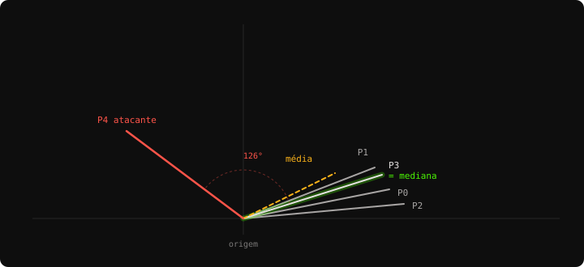

# Aritmética da Reputação

AwakeFL · documento de estudo

Cada regra e cada conta do AwakeFL, na ordem em que o sistema as executa. Um exemplo com cinco participantes atravessa o documento inteiro — os mesmos números, do primeiro cosseno até o banimento.

## Sumário

- [O que o sistema mede não é o modelo, é o empurrão](#o-que-o-sistema-mede-não-é-o-modelo-é-o-empurrão)
- [Uma pergunta só, feita toda rodada](#uma-pergunta-só-feita-toda-rodada)
- [Cosseno: um número para "mesmo lado"](#cosseno-um-número-para-mesmo-lado)
- [Comparado com quem? A mediana](#comparado-com-quem-a-mediana)
- [A norma, e por que ela é medida dos dois lados](#a-norma-e-por-que-ela-é-medida-dos-dois-lados)
- [S(t): as duas medidas viram uma nota](#st-as-duas-medidas-viram-uma-nota)
- [Por que dividir pelo cosseno mediano](#por-que-dividir-pelo-cosseno-mediano)
- [A brecha do atacante esperto, e a trava](#a-brecha-do-atacante-esperto-e-a-trava)
- [R(t): de nota da rodada para reputação](#rt-de-nota-da-rodada-para-reputação)
- [A decisão irreversível](#a-decisão-irreversível)
- [A clínica pequena era banida por ser pequena](#a-clínica-pequena-era-banida-por-ser-pequena)
- [Duas formas de consertar, atacando pontos diferentes](#duas-formas-de-consertar-atacando-pontos-diferentes)
- [Cartão de bolso](#cartão-de-bolso)

---

## Como este documento funciona

*Antes de começar*

Cada passo aparece três vezes, sempre na mesma ordem: **a regra** (a fórmula), **em português** (a mesma coisa sem símbolos) e **com números** (a conta feita, que você pode conferir na calculadora).

Não é preciso saber álgebra linear. As duas únicas ideias emprestadas da matemática — cosseno e mediana — estão explicadas do zero, nos passos 2 e 3.

> **O exemplo**
>
> Cinco instituições, quatro honestas e uma atacante. Para caber num desenho, os números têm **duas dimensões** em vez das 215.370 do modelo real. A conta é exatamente a mesma — só o tamanho da lista muda.

## O que o sistema mede não é o modelo, é o empurrão

*Passo 0*

Toda rodada começa igual: o servidor manda o **modelo global** para todos. Cada instituição treina nos próprios dados e devolve o modelo já modificado. O sistema não olha o modelo devolvido — olha a **diferença**:

```text
update do participante  =  pesos que ele devolveu  −  pesos que ele recebeu
```

> **Em português**
>
> O update é *para onde* aquele participante quis puxar o modelo, e *com quanta força*. É o único objeto que o resto do documento manipula.

No modelo real esse update é uma lista de 215.370 números. Isso assusta, mas não muda nada: uma lista de números é um **vetor**, e um vetor tem só dois atributos que interessam aqui — a **direção** para onde aponta e o **tamanho** dele.

No nosso exemplo cada update tem dois números, então dá para desenhar como uma seta num plano. Este é o ponto de partida:

```text
Os updates da rodada 1P0  honesto    [  1,00 ,  0,20 ]
P1  honesto    [  0,90 ,  0,35 ]
P2  honesto    [  1,10 ,  0,10 ]
P3  honesto    [  0,95 ,  0,30 ]
P4  ATACANTE   [ −0,80 ,  0,60 ]   ← puxa para o outro lado
```

## Uma pergunta só, feita toda rodada

*Passo 1*

O sistema inteiro existe para responder uma pergunta, repetida a cada rodada para cada participante:

```text
"Este empurrão combina com o que o resto do grupo está fazendo?"
```

> **Em português**
>
> Ninguém verifica os dados de ninguém — esse é o ponto do Federated Learning. O que dá para verificar é se a contribuição de alguém *destoa* das outras.

Repare no que isso **não** é: não é um teste de honestidade. É um teste de consistência com o consenso. Guarde essa distinção — ela volta no passo 10, e é dela que nasce o único defeito sério do desenho.

"Combinar com o grupo" se quebra em duas perguntas menores, que o sistema mede separadamente:

- **Direção** — você está puxando para o mesmo lado? (passo 2)
- **Tamanho** — você está puxando com força parecida? (passo 4)

## Cosseno: um número para "mesmo lado"

*Passo 2*

Para comparar duas direções usamos a **similaridade de cosseno**. Apesar do nome, a ideia é simples: é um número entre −1 e 1 que responde "essas duas setas apontam para o mesmo lugar?".

```text
cos(a, b)  =  (a · b) / (|a| × |b|)

onde   a · b  =  a₁×b₁ + a₂×b₂ + …     (soma dos produtos, item a item)
       |a|    =  √(a₁² + a₂² + …)       (o "tamanho" do vetor)
```

> **Em português**
>
> **1,0** = mesma direção exata. **0,0** = direções sem relação, perpendiculares. **−1,0** = direções opostas. Dividir pelos tamanhos é o que faz o resultado depender *só* do ângulo.

### Por que cosseno, e não distância

Essa divisão pelos tamanhos é a razão da escolha. Um hospital com muitos dados produz naturalmente um update maior — ele deu mais passos de treino. Se medíssemos **distância** entre os updates, esse hospital pareceria divergente só por ser grande, e seria punido por isso. O cosseno ignora o tamanho e pergunta apenas pelo ângulo.

O tamanho não é jogado fora — ele vira uma medida própria, no passo 4. Separar as duas coisas é o que permite tratá-las com pesos diferentes.

```text
Conferindo com P0 = [1,00 · 0,20] e P1 = [0,90 · 0,35]produto:   1,00×0,90 + 0,20×0,35  =  0,900 + 0,070  =  0,970
|P0|:      √(1,00² + 0,20²)       =  √1,0400        =  1,020
|P1|:      √(0,90² + 0,35²)       =  √0,9325        =  0,966

cos    =   0,970 / (1,020 × 0,966)  =  0,985   ← quase o mesmo lado
```

## Comparado com quem? A mediana

*Passo 3*

Cosseno compara dois vetores. Mas queremos comparar um participante com *o grupo* — e para isso é preciso construir um vetor que represente o grupo. A escolha desse vetor é a decisão de segurança mais importante do sistema.

```text
referência  =  mediana coordenada a coordenada dos updates confiáveis
```

> **Em português**
>
> Para cada posição da lista, pegue o valor daquela posição em todos os participantes, coloque em ordem e fique com o do meio. Faça isso em cada posição. O resultado é o "empurrão típico" da rodada.

```text
Construindo a referência1ª coordenada   valores: −0,80  0,90  0,95  1,00  1,10   → mediana  0,95
2ª coordenada   valores:  0,10  0,20  0,30  0,35  0,60   → mediana  0,30

referência  =  [ 0,95 , 0,30 ]

A média daria [0,63 · 0,31] — arrastada 34% para a esquerda por um
único atacante, que nem precisou exagerar para conseguir isso.
```

### Por que mediana e não média

A média é **frágil**: qualquer valor extremo a puxa, e a puxa proporcionalmente ao exagero. Um atacante que amplificasse o próprio update em 100× moveria a média para perto de si — e passaria a ser ele *o consenso*. Todos os honestos ficariam divergentes em relação a ele. A defesa se viraria do avesso.

A mediana só olha *posição na fila*, não valor. Multiplicar o próprio update por 100 não muda em nada onde ele cai na ordenação: ele continua sendo o último. É por isso que se diz que a mediana tem **ponto de ruptura de 50%** — só é possível corrompê-la controlando mais da metade dos participantes.



*Os quatro honestos formam um feixe estreito; o atacante abre 126° em relação ao consenso. A mediana (verde) cai dentro do feixe — neste exemplo ela coincide exatamente com P3, o que é comum: a mediana tende a pousar sobre um membro típico. A média (tracejado âmbar) já saiu do feixe, puxada pelo atacante.*

## A norma, e por que ela é medida dos dois lados

*Passo 4*

A segunda metade da pergunta: você está puxando com *força* parecida com a do grupo? A força de um update é a norma dele — o comprimento da seta.

```text
r  =  |update do participante| / |norma mediana do grupo|

magnitude  =  min( r , 1/r )        →  sempre entre 0 e 1
```

> **Em português**
>
> Divida seu tamanho pelo tamanho típico. Se der mais que 1, inverta. Assim o resultado vale 1,0 quando você está no tamanho certo e cai para 0 conforme você se afasta — **para qualquer um dos lados**.

### Por que punir também quem é pequeno demais

Punir updates gigantes é intuitivo: é o envenenamento por amplificação. Punir updates minúsculos parece estranho até você pensar no **free-rider** — o participante que não treina nada e devolve o modelo quase intocado, colhendo o benefício do trabalho alheio.

O cosseno sozinho não pega esse tipo: quem quase não se move tem uma direção essencialmente aleatória, que às vezes calha de apontar para o lado certo. O termo simétrico de magnitude pega — porque um update praticamente nulo tem `r` perto de zero.

```text
As normas da rodada|P0| = 1,020     |P1| = 0,966     |P2| = 1,105
|P3| = 0,996     |P4| = 1,000

norma mediana do grupo  =  1,000

P2:  r = 1,105 / 1,000 = 1,105  →  min(1,105 ; 0,905) = 0,905
P4:  r = 1,000 / 1,000 = 1,000  →  min(1,000 ; 1,000) = 1,000  ← nota máxima!
```

> **Repare nisto**
>
> O atacante tira **1,000** em magnitude — o tamanho do update dele é exatamente o típico. Um sistema que olhasse só o tamanho o consideraria irrepreensível. É o cosseno que o denuncia, e é por isso que a direção pesa mais que a magnitude na conta final.

## S(t): as duas medidas viram uma nota

*Passo 5*

```text
S(t)  =  0,7 × direção  +  0,3 × magnitude
```

> **Em português**
>
> A nota daquele participante *naquela rodada*, entre 0 e 1. A direção vale mais que o dobro do tamanho porque é ela que pega os ataques que importam — e porque tamanho é fácil de imitar.

O termo de direção não é o cosseno cru: ele é dividido pelo cosseno mediano da rodada. Esse detalhe tem um passo só para ele, o próximo. Por ora, veja a conta completa dos cinco:

| Participante | cos | direção | magnitude | conta | S(t) |
| --- | ---: | ---: | ---: | --- | ---: |
| P0 honesto | 0,994 | 1,000 | 0,981 | 0,7×1,000 + 0,3×0,981 | 0,994 |
| P1 honesto | 0,998 | 1,000 | 0,966 | 0,7×1,000 + 0,3×0,966 | 0,990 |
| P2 honesto | 0,977 | 0,983 | 0,905 | 0,7×0,983 + 0,3×0,905 | 0,960 |
| P3 honesto | 1,000 | 1,000 | 0,996 | 0,7×1,000 + 0,3×0,996 | 0,999 |
| P4 atacante | 0,000 | 0,000 | 1,000 | 0,7×0,000 + 0,3×1,000 | 0,300 |

A separação é limpa: honestos entre 0,96 e 1,00, atacante em 0,30. E repare de onde vem o 0,30 do atacante — é *exatamente* o peso da magnitude. Ele zerou a direção e ficou só com a nota de tamanho.

O cosseno dele é 0,000 e não negativo porque cossenos negativos são cortados em zero antes da conta. Apontar 143° para fora e apontar 180° para fora são a mesma coisa do ponto de vista da defesa: ambos são "nenhum crédito de direção".

## Por que dividir pelo cosseno mediano

*Passo 6*

Este é o passo mais sutil do sistema, e o que faz ele funcionar fora do laboratório.

Quanto os honestos concordam entre si *não é uma constante*. Com dados parecidos entre as instituições, os updates honestos têm cosseno ~0,9 entre si. Com dados heterogêneos — cada hospital atendendo uma população diferente, que é o caso realista — esse número cai para ~0,4 **sem ninguém ser malicioso**. E ele também muda ao longo do treino, conforme o modelo converge.

> **O que aconteceria com um limiar fixo**
>
> Um corte fixo em, digamos, 0,7 teria dois comportamentos, ambos inúteis: com dados heterogêneos **bane a federação inteira** (todo mundo está abaixo de 0,7); com dados parecidos **não pega ninguém** (todo mundo está acima).

```text
direção  =  min( 1 , cos do participante / cos mediano da rodada )
```

> **Em português**
>
> Em vez de perguntar "seu cosseno é alto?", pergunta **"seu cosseno é pior que o do participante do meio, hoje?"** A régua é remedida a cada rodada, com os participantes daquela rodada.

```text
A régua desta rodadacossenos:  0,000   0,977   0,994   0,998   1,000
                            └── mediano = 0,994

P2:  0,977 / 0,994  =  0,983   ← um pouquinho pior que o mediano
P0:  0,994 / 0,994  =  1,000
P3:  1,000 / 0,994  =  1,006  →  cortado em 1,000   ← ninguém tira mais que a nota máxima
```

Quem está acima do mediano recebe 1,0 e pronto — não há prêmio por ser mais alinhado que o grupo. A escala mede uma coisa só: *o quanto você está pior que o participante típico de hoje*. É essa pergunta que continua fazendo sentido tanto com dados parecidos quanto com dados heterogêneos.

## A brecha do atacante esperto, e a trava

*Passo 7*

Um atacante que leia tudo até aqui percebe uma saída. A direção vale 0,7 da nota. E se ele apontar *exatamente para o mesmo lado que o grupo*, mas com uma seta enorme?

Ele tiraria 1,0 em direção. Perderia pontos só na magnitude — 0,3 no máximo. E como a agregação soma os updates, uma seta muito maior que as outras **domina o resultado**: é o ataque de *substituição de modelo*, que injeta um backdoor sem nunca divergir em ângulo.

```text
se  |update| > 2,5 × mediana   ou   |update| < mediana / 2,5
então  crédito de direção = 0  →  S(t) = 0,3 × magnitude
```

> **Em português**
>
> Fora da faixa de tamanho razoável, apontar para o lado certo **não vale mais nada**. A nota passa a depender só da magnitude — que, por definição, já está péssima.

A trava é um *veto*, não um desconto: não reduz o crédito de direção proporcionalmente, zera. É deliberado. Um desconto proporcional deixaria o atacante otimizar a amplificação até o ponto exato em que o ganho de influência compensasse a perda de nota. Zerar remove o cálculo: não existe amplificação que valha a pena.

## R(t): de nota da rodada para reputação

*Passo 8*

S(t) é a nota de *uma* rodada, e uma rodada ruim acontece com gente honesta — uma partição infeliz de dados, um lote azarado. Banir alguém por um único S baixo seria injusto e frágil.

A reputação R(t) é a memória disso ao longo do tempo:

```text
R(t)  =  0,5 × R(t−1)  +  0,5 × S(t)

R(0) = 0,5 para todos    (neutro — todo participante começa no meio)
```

> **Em português**
>
> A reputação nova é metade da antiga mais metade da nota de hoje. Uma rodada ruim derruba pela metade; duas seguidas derrubam a três quartos. O passado nunca some de vez, só encolhe.

```text
Os mesmos S(t) repetidos por seis rodadas            R(0)    R(1)    R(2)    R(3)    R(4)    R(5)    R(6)

P0 S=0,994  0,500   0,747   0,871   0,932   0,963   0,979   0,986
P4 S=0,300  0,500   0,400   0,350   0,325   0,312   0,306   0,303
```

### Duas propriedades que valem entender

**R esquece de onde partiu.** Os dois começam em 0,5 e cada um converge para o próprio S — 0,986 ≈ 0,994 e 0,303 ≈ 0,300. O peso do valor inicial cai pela metade a cada rodada: 50%, 25%, 12%, 6%, 3%. Em cinco rodadas ele praticamente não existe mais.

**Por isso o valor inicial não é um parâmetro de detecção.** Isso foi medido no projeto: reaplicando a fórmula sobre os mesmos S(t) observados, começar em 1,0 em vez de 0,5 antecipou o banimento em uma rodada em apenas um de três atacantes. R(0) = 0,5 existe por outro motivo — se o recém-chegado nascesse com nota máxima, um atacante banido criaria outra carteira e voltaria com a ficha limpa.

O fator 0,5 é o botão de sensibilidade. Maior (0,8) = mais memória, perdoa mais, demora mais para detectar. Menor (0,2) = reage rápido, e pune ruído como se fosse ataque.

## A decisão irreversível

*Passo 9*

```text
se  R(t) < 0,4  e  o participante já tem mais de 2 contribuições:

    R  ←  R / 10          (a penalidade)
    banido  ←  verdadeiro  (permanente, sem reversão)
```

> **Em português**
>
> Cruzou o limiar, a reputação é dividida por dez e o participante sai da federação para sempre. Não entra mais na agregação, não é mais pontuado, e não conta mais para a mediana.

Na tabela do passo 8, P4 cruza 0,4 já na rodada 2 (R = 0,350). Com a penalidade, a reputação final dele é 0,035.

### Por que dividir por 10, se ele já está abaixo do limiar

A divisão não serve para a decisão de agora — serve contra o **adversário paciente**: aquele que contribui honestamente por vinte rodadas, acumula reputação alta, e ataca na vigésima primeira contando com a memória da fórmula para amortecer a queda. A divisão por 10 torna a reputação acumulada sem valor no instante do flagrante. Não existe crédito guardado que compre um ataque.

### Por que permanente

Se banir fosse temporário, a estratégia ótima do atacante seria atacar de forma intermitente: envenena, cumpre a suspensão, volta, envenena de novo. A irreversibilidade elimina esse ciclo. O custo dessa escolha é real e aparece no próximo passo.

### A carência

As duas primeiras contribuições *de cada participante* são imunes. E são contadas por **tempo de casa**, não por número da rodada — quem se registra na rodada 50 tem a mesma proteção de quem estava lá desde o começo. É quando ele mais precisa: está sozinho carregando uma distribuição de dados que ninguém mais tem.

## A clínica pequena era banida por ser pequena

*Passo 10*

Rodando o experimento com dez sementes diferentes, a detecção pegou **30 de 30 atacantes**. Mas a precisão não foi perfeita: houve um falso positivo. Um participante *honesto*, banido permanentemente.

Este passo descreve o sistema **antes** da correção — que vem no passo 11 e hoje está ativa por padrão. A falha é apresentada primeiro de propósito: sem entender o defeito, a correção vira só mais um parâmetro.

A investigação foi contraintuitiva. O suspeito óbvio seria uma distribuição de dados esquisita — mas ele tinha a distribuição *mais equilibrada* da federação. O que ele tinha de diferente era tamanho: **436 amostras**, contra 2.149 do maior.

```text
Os 70 participantes honestos das 10 execuçõescom menos de 600 amostras   (3 participantes)   S médio = 0,621
com 600 ou mais           (67 participantes)  S médio = 0,931
```

Existe um **penhasco**. E a causa não tem nada a ver com honestidade:

```text
436 amostras ÷ lote de 32  =  ~14 passos de treino
2.149 amostras ÷ lote de 32  =  ~67 passos de treino

ruído da direção  ∝  1 / √(passos)      →   √(67/14) ≈ 2,2× mais ruído
```

> **Em português**
>
> Quem tem menos dados dá menos passos de treino, e um update feito de poucos passos é **chacoalhado** pelo acaso da amostragem. A seta dele treme. O cosseno contra o consenso cai — mesmo que a direção verdadeira dele esteja perfeitamente certa.

> **A conclusão desconfortável**
>
> O score não está errado. Ele mede exatamente o que promete: distância do consenso. O problema é que **estar longe do consenso tem duas causas** — ser malicioso e ser pequeno demais para produzir um update estável — e a fórmula não as distingue.
>
> Traduzido para o mundo real: a clínica pequena é banida, de forma permanente, por ser pequena.

## Duas formas de consertar, atacando pontos diferentes

*Passo 11*

> **Situação atual**
>
> As duas correções desta seção estão **ligadas por padrão** desde a medição descrita aqui. O passo 10 descreve o sistema como ele era antes delas — a falha é apresentada primeiro porque entender o defeito é o que faz a correção fazer sentido.

### Correção A — igualar os passos, não as épocas

Hoje cada participante faz *uma passagem completa* pelos próprios dados. Quem tem mais dados dá mais passos. Trocando por **um número fixo de passos para todos**, o participante pequeno simplesmente repassa mais vezes pelo que tem, e o ruído se iguala.

Isso ataca a *causa*. O preço é trocar ruído por viés: quem repassa muitas vezes os mesmos poucos dados se especializa mais neles.

### Correção B — suavizar o update, não o score

Esta aponta um erro sutil no desenho atual. A reputação já faz uma média ao longo do tempo — mas **média de quê**? Hoje ela tira a média dos *scores*, e cada score já veio achatado pelo ruído. A média de valores achatados continua achatada.

```text
média( cos(direção + ruído) )   <   cos( média(direção + ruído) )
       ↑ o que R(t) faz hoje          ↑ o que a correção B faz
```

> **Em português**
>
> O ruído tem média zero: somando os updates de várias rodadas, ele se cancela sozinho e sobra a direção verdadeira. Mas se você *primeiro* transforma cada update numa nota e só *depois* tira a média, o cancelamento nunca acontece — a informação já foi jogada fora na conversão.

Um viés malicioso, por ser sistemático e não aleatório, atravessa a média intacto. Então a correção devolve pontos a quem é ruidoso sem devolver nada a quem é malicioso.

### O que aconteceu quando medimos

As duas correções foram rodadas nas mesmas cinco sementes, com os mesmos atacantes. A coluna que importa é a **lacuna**: o quanto os participantes pequenos ficam abaixo dos grandes.

| Configuração | S pequenos | S grandes | lacuna | recall | falsos+ |
| --- | ---: | ---: | ---: | ---: | ---: |
| sem correção | 0,568 | 0,930 | 0,362 | 1,00 | 1 |
| A — passos fixos | 0,918 | 0,941 | 0,023 | 1,00 | 0 |
| B — update suavizado | 0,764 | 0,935 | 0,171 | 1,00 | 0 |
| **A + B** | **0,972** | **0,944** | **−0,028** | **1,00** | **0** |

As três eliminaram o falso positivo sem perder um único atacante. Mas o *quando* separa as duas, e é o que decide qual adotar:

```text
S dos participantes pequenos, rodada a rodadarodada        1      2      3      4      5      6      7      8

sem correção  0,583  0,760  0,353  0,590  0,343  0,369  0,833  0,757
A: passos     0,964  0,962  0,959  0,945  0,852  0,946  0,870  0,911
B: suave      0,583  0,744  0,377  0,581  0,784  0,823  0,795  0,867

A já está alta na rodada 1. B é idêntica à base até a rodada 4 —
a média precisa de rodadas para acumular antes de cancelar o ruído.
```

**A remove a causa; B compensa o efeito, e compensa tarde.** No caso real que investigamos, o participante honesto foi banido na rodada 5 — a correção B chegou a tempo por uma rodada. Se o azar tivesse vindo na rodada 3, ela não teria salvado ninguém. A carência dura duas contribuições; B só começa a agir na quinta.

Por isso as duas juntas são melhores que qualquer uma sozinha, e não por somarem efeito: elas cobrem *momentos diferentes*. A protege desde a primeira rodada, B continua melhorando a medida conforme a federação acumula histórico.

### O resultado com as duas ligadas

Com as correções no padrão, o experimento inteiro foi refeito em dez sementes independentes. Este é o número que vale para o texto:

| 10 sementes | S pequenos | S grandes | lacuna | precisão | falsos+ |
| --- | ---: | ---: | ---: | ---: | ---: |
| antes | 0,592 | 0,927 | 0,336 | 0,97 | 1 |
| **depois** | **0,945** | **0,945** | **−0,001** | **1,00** | **0** |

**0,945 contra 0,945.** O detector deixou de enxergar tamanho: um participante pequeno agora pontua exatamente como um grande. E a detecção não pagou nada por isso — precisão e recall 1,00 nas dez sementes, com os 30 atacantes banidos.

| 10 sementes | antes | depois |
| --- | ---: | ---: |
| A — baseline | 98,25% ± 0,26 | 98,23% ± 0,33 |
| B — ataque | 63,14% ± 24,03 | 69,13% ± 26,78 |
| C — defesa | 97,85% ± 0,29 | 98,02% ± 0,35 |
| rodadas até banir | 5,80 ± 0,76 | 5,40 ± 0,68 |

O ataque continua forte (queda de 29,1 pp) e a distância entre a defesa e o baseline caiu de 0,40 pp para 0,21 pp. A detecção ficou até um pouco mais rápida.

> **Honestidade sobre a amostra**
>
> Apenas **três** dos 70 participantes honestos ficaram abaixo de 600 amostras nessas dez sementes. A direção do efeito é inequívoca, o mecanismo é entendido e o falso positivo desapareceu — mas com três casos, a magnitude exata do 0,945 ainda carrega incerteza. Mais sementes só melhoram esse número.

> **A armadilha de incentivo**
>
> Qualquer correção que dê tolerância a quem tem poucos dados esbarra num problema: o número de amostras é **auto-declarado**. Um atacante pode dizer que é pequeno para comprar indulgência.
>
> O que segura o desenho é que o mesmo número também pondera a agregação. Declarar-se pequeno compra tolerância *e paga com influência* — e influência é justamente o que o atacante quer. A regra a nunca violar: a tolerância não pode crescer mais rápido que a perda de influência.

O critério de aceite era duplo de propósito, senão a "correção" viraria um buraco de segurança: o S dos pequenos precisava subir **e** a detecção precisava continuar pegando todos os atacantes. As duas passaram nos dois.

### A armadilha de escolher o número de passos

A correção A tem um parâmetro — *quantos* passos — e a primeira escolha foi errada de um jeito instrutivo. Fixamos 40, perto da **média** dos participantes. O viés sumiu, mas o experimento inteiro desmoronou junto:

```text
Queda de acurácia causada pelo ataque (semente 42)épocas locais (antes)        14,7 pp
40 passos (perto da média)    0,95 pp   ← o ataque praticamente sumiu
'auto' (época do maior)      11,7 pp
```

O motivo: passos fixos mexem no treino de **todo mundo**, inclusive dos atacantes. Nessa federação o maior participante dava 60 passos por época e o menor, 18. Fixar em 40 dava 22 passos a mais ao pequeno — *e tirava 20 do grande*. Como os atacantes estavam entre os grandes, o ataque perdeu um terço da força de envenenamento, e o cenário B deixou de demonstrar qualquer coisa.

```text
local_steps = "auto"  →  passos de UMA época do MAIOR participante
```

> **Em português**
>
> Nivele **por cima**, não pela média. Assim ninguém treina menos do que treinaria antes — só os pequenos treinam mais. O viés some sem que o experimento mude de assunto.

O preço de nivelar por cima é o participante pequeno repassar várias vezes pelos próprios dados — quatro vezes, no caso extremo medido — e sobreajustar um pouco mais. Entre um participante pequeno que sobreajusta e um participante pequeno banido por engano, o projeto escolhe o primeiro.

## Cartão de bolso

*Passo 12*

Tudo o que o sistema calcula, em ordem de execução, numa página.

### Por rodada, para cada participante

```text
0.  treino local =  N passos de SGD, IGUAIS para todos
                   (N = uma época do maior participante)

1.  update      =  pesos devolvidos − pesos recebidos

2.  suavizado   =  0,5 × suavizado anterior  +  0,5 × update
                   (tudo daqui para baixo usa o suavizado)

3.  referência  =  mediana coordenada a coordenada dos confiáveis

4.  cos         =  (update · referência) / (|update| × |referência|)
    direção     =  min( 1 , max(0, cos) / cos mediano da rodada )

5.  r           =  |update| / norma mediana
    magnitude   =  min( r , 1/r )

6.  veto        =  se r > 2,5 ou r < 1/2,5  →  direção = 0

7.  S(t)        =  0,7 × direção  +  0,3 × magnitude

8.  R(t)        =  0,5 × R(t−1)  +  0,5 × S(t)

9.  se R(t) < 0,4 e contribuições > 2:
        R ← R / 10 ,  banido para sempre

10. agregação   =  média dos não-banidos, ponderada por
                   nº de amostras × reputação
```

Os passos **0** e **2** são as correções do passo 11. Repare que há duas médias móveis e elas fazem coisas diferentes: a do passo 2 cancela o *ruído do update*; a do passo 8 dá *memória à reputação*. Suavizar nos dois lugares não é redundância — é o que separa "esta rodada foi ruidosa" de "este participante vem sendo inconsistente".

| Parâmetro | Padrão | O que muda se você mexer |
| --- | ---: | --- |
| passos locais | auto | nivelar pela média quebra o experimento |
| suavização do update | 0,5 | maior = cancela mais ruído, reage mais devagar |
| peso da direção | 0,7 | maior = mais sensível a ataques de rótulo |
| peso da magnitude | 0,3 | maior = mais sensível a free-rider |
| fator da média móvel | 0,5 | maior = mais memória, detecta mais devagar |
| reputação inicial | 0,5 | não afeta detecção; afeta whitewashing |
| limiar de banimento | 0,4 | maior = mais falso positivo |
| divisor da penalidade | 10 | maior = pior para o adversário paciente |
| carência | 2 | contribuições, não rodadas |
| veto de norma | 2,5× | menor = mais rígido com amplificação |

Os números do exemplo saíram do próprio código — `reputation.py`, as mesmas funções que rodam no experimento. Os resultados de 10 sementes vêm de `sweep.py`, e a análise do viés de tamanho de `analise_tamanho.py`, ambos reproduzíveis com um comando. Este documento acompanha a *Anatomia do AwakeFL*, que cobre a arquitetura; aqui só as contas.
